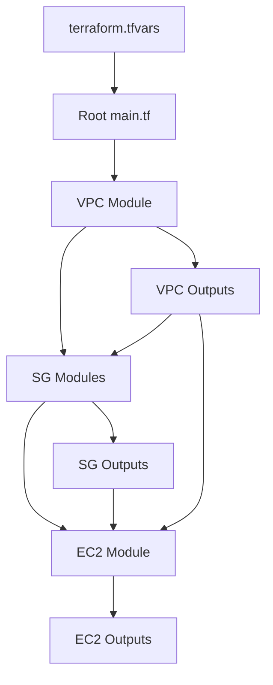

# IaaC Terraform Project

This project demonstrates Infrastructure as Code (IaaC) using Terraform to provision AWS resources including VPC, subnets, security groups, and EC2 instances. The architecture follows a modular approach with reusable modules for VPC, EC2, and Security Groups.

## Architecture Overview

The project is structured into environments (e.g., `dev`) and modules. The `dev` environment orchestrates the creation of resources by calling the modules with specific configurations.

### Key Components
- **VPC Module**: Creates a VPC with public and private subnets, internet gateway, NAT gateway, and route tables.
- **EC2 Module**: Provisions EC2 instances using a map-based configuration with `for_each`.
- **Security Group (SG) Module**: Creates security groups with dynamic ingress and egress rules using `for_each`.

## Detailed Code Flow Analysis

### 1. VPC Module Flow

The VPC module (`modules/vpc/`) creates the foundational network infrastructure.

#### Variables
- `vpc_cidr`: CIDR block for the VPC (e.g., "10.0.0.0/16")
- `public_subnets`: Map of availability zone to CIDR (e.g., {"ap-south-1a": "10.0.1.0/24"})
- `private_subnets`: Similar map for private subnets
- `name`: Prefix for resource names

#### Resource Creation Flow
1. `aws_vpc.iaac_vpc`: Creates the VPC with DNS support enabled.
2. `aws_internet_gateway.igw`: Attached to the VPC for internet access.
3. `aws_subnet.public`: Uses `for_each = var.public_subnets` to create public subnets. Each iteration creates a subnet in the specified AZ with `map_public_ip_on_launch = true`.
4. `aws_subnet.private`: Similar to public subnets but without public IP mapping.
5. `aws_eip.nat_ip` and `aws_nat_gateway.nat_gateway`: Creates NAT gateway in the first public subnet for private subnet internet access.
6. Route tables and associations: Public RT routes to IGW, private RT routes to NAT.

#### Example: How `for_each` Works in VPC Subnets
From `terraform.tfvars`:
```hcl
public_subnets = {
  "ap-south-1a" = "10.0.1.0/24"
  "ap-south-1b" = "10.0.2.0/24"
}
```

In `modules/vpc/main.tf`:
```hcl
resource "aws_subnet" "public" {
  for_each                = var.public_subnets
  vpc_id                  = aws_vpc.iaac_vpc.id
  cidr_block              = each.value  # "10.0.1.0/24" for first iteration
  availability_zone       = each.key   # "ap-south-1a" for first iteration
  map_public_ip_on_launch = true
  tags = {
    Name = "${var.name}-public-subnet-${each.key}"  # "dev-vpc-public-subnet-ap-south-1a"
  }
}
```

This creates two public subnets: one in ap-south-1a with CIDR 10.0.1.0/24, and one in ap-south-1b with 10.0.2.0/24.

#### Outputs
- `vpc_id`: VPC ID
- `public_subnet_ids`: List of public subnet IDs (e.g., ["subnet-12345", "subnet-67890"])
- `private_subnets_ids`: List of private subnet IDs

### 2. EC2 Module Flow

The EC2 module (`modules/ec2/`) provisions multiple EC2 instances dynamically.

#### Variables
- `instances`: A map where keys are instance names and values are objects containing:
  - `ami`: AMI ID
  - `instance_type`: Instance type (e.g., "t3.micro")
  - `subnet_id`: Subnet to launch in
  - `security_groups`: List of security group IDs
  - `tags`: Additional tags
- `key_name`: SSH key pair name

#### How `for_each` Works in EC2 Module

```hcl
resource "aws_instance" "instance" {
  for_each = var.instances
  ami           = each.value.ami
  instance_type = each.value.instance_type
  subnet_id     = each.value.subnet_id
  key_name      = var.key_name
  vpc_security_group_ids = each.value.security_groups
  tags = merge(each.value.tags, { Name = each.key })
}
```

#### Example: Instances Map and Iteration
From `environments/dev/main.tf`:
```hcl
module "ec2" {
  source   = "../../modules/ec2"
  key_name = var.key_name  # "iaac" from terraform.tfvars
  instances = {
    webserver1 = {
      ami             = var.ami_id          # "ami-087d1c9a513324697"
      instance_type   = "t3.micro"
      subnet_id       = module.vpc.public_subnet_ids[0]  # First public subnet ID
      security_groups = [module.web_sg.sg_id]           # List with one SG ID
      tags = {
        Role = "webserver"
      }
    }
    dbserver = {
      ami             = var.ami_id
      instance_type   = "t3.micro"
      subnet_id       = module.vpc.private_subnets_ids[0]  # First private subnet ID
      security_groups = [module.dbserver_sg.sg_id]
      tags = {
        Role = "DBserver"
      }
    }
  }
}
```

**Iteration Breakdown:**
- **First iteration** (`each.key = "webserver1"`, `each.value = {ami: "...", instance_type: "t3.micro", ...}`):
  - Creates EC2 instance named "webserver1"
  - Uses AMI "ami-087d1c9a513324697"
  - Launches in public subnet (e.g., subnet-12345)
  - Attaches webserver SG
  - Tags: {Name: "webserver1", Role: "webserver"}

- **Second iteration** (`each.key = "dbserver"`):
  - Creates EC2 instance named "dbserver"
  - Same AMI and type
  - Launches in private subnet (e.g., subnet-67890)
  - Attaches dbserver SG
  - Tags: {Name: "dbserver", Role: "DBserver"}

#### Variable Picking
Variables flow as follows:
1. `terraform.tfvars` defines base values (e.g., `ami_id = "ami-087d1c9a513324697"`)
2. Root `variables.tf` declares variables
3. Root `main.tf` passes values to modules, referencing other module outputs
4. Module `variables.tf` defines input types
5. Module `main.tf` uses the variables in resources

Example chain:
- `var.ami_id` (from tfvars) → `module.ec2.instances["webserver1"].ami` → `each.value.ami` in EC2 resource

#### Outputs
- `instance_id`: List of all instance IDs (e.g., ["i-123", "i-456"])
- `private_ip`: List of private IPs (e.g., ["10.0.1.10", "10.0.3.20"])
- `public_ips`: List of public IPs (for public instances)

### 3. Security Group (SG) Module Flow

The SG module creates security groups with dynamic rules.

#### Variables
- `sg_name`: Name of the security group
- `vpc_id`: VPC to create SG in
- `ingress_rules`: List of ingress rule objects
- `egress_rules`: List of egress rule objects (defaults to allow all outbound)

Each rule object contains:
- `from_port`, `to_port`, `protocol`, `cidr_blocks`, `description` (optional)

#### How `for_each` Works in SG Module

For ingress rules:
```hcl
resource "aws_security_group_rule" "ingress" {
  for_each = { for idx, rule in var.ingress_rules : idx => rule }
  type              = "ingress"
  from_port         = each.value.from_port
  to_port           = each.value.to_port
  protocol          = each.value.protocol
  cidr_blocks       = each.value.cidr_blocks
  security_group_id = aws_security_group.sg.id
  description       = lookup(each.value, "description", null)
}
```

#### Example: Ingress Rules List and Transformation
From `environments/dev/main.tf` (for web_sg):
```hcl
ingress_rules = [
  {
    from_port   = 22
    to_port     = 22
    protocol    = "tcp"
    cidr_blocks = ["0.0.0.0/0"]
    description = "SSH access"
  },
  {
    from_port   = 80
    to_port     = 80
    protocol    = "tcp"
    cidr_blocks = ["0.0.0.0/0"]
    description = "HTTP access"
  }
]
```

**Transformation to Map:**
```hcl
{ for idx, rule in var.ingress_rules : idx => rule }
```
Results in:
```hcl
{
  0 = {
    from_port   = 22
    to_port     = 22
    protocol    = "tcp"
    cidr_blocks = ["0.0.0.0/0"]
    description = "SSH access"
  }
  1 = {
    from_port   = 80
    to_port     = 80
    protocol    = "tcp"
    cidr_blocks = ["0.0.0.0/0"]
    description = "HTTP access"
  }
}
```

**Iteration Breakdown:**
- **First rule** (`each.key = 0`, `each.value = {from_port: 22, ...}`):
  - Creates ingress rule allowing TCP port 22 from anywhere
  - Description: "SSH access"

- **Second rule** (`each.key = 1`):
  - Creates ingress rule allowing TCP port 80 from anywhere
  - Description: "HTTP access"

#### Variable Picking and Functions
- `sg_name` and `vpc_id` are passed directly from the root module (e.g., `vpc_id = module.vpc.vpc_id`).
- `ingress_rules` is defined as a list in the root module call.
- `lookup(each.value, "description", null)`: Retrieves the "description" key from the rule object. If present, uses it; otherwise, sets to null.

Example:
- For the SSH rule: `lookup({from_port: 22, ..., description: "SSH access"}, "description", null)` → "SSH access"
- If description was omitted: `lookup({from_port: 22, ...}, "description", null)` → null

#### Outputs
- `sg_id`: Security group ID (e.g., "sg-12345")
- `sg_name`: Security group name (e.g., "webserver-sg")

## Module Interdependencies

The modules are called in the root `main.tf` with dependencies:

1. **VPC module** is called first (no dependencies).
   - Outputs: `vpc_id`, `public_subnet_ids`, `private_subnets_ids`

2. **SG modules** (`web_sg`, `dbserver_sg`) depend on VPC for `vpc_id`.
   - Input: `vpc_id = module.vpc.vpc_id`
   - Outputs: `sg_id`

3. **EC2 module** depends on VPC for subnet IDs and SG modules for security group IDs.
   - Inputs: `subnet_id = module.vpc.public_subnet_ids[0]`, `security_groups = [module.web_sg.sg_id]`
   - Outputs: `instance_id`, `private_ip`, `public_ips`

Example dependency chain:
- VPC creates subnets → EC2 uses `module.vpc.public_subnet_ids[0]` for webserver subnet
- VPC creates VPC → SG uses `module.vpc.vpc_id` for SG creation
- SG creates SG → EC2 uses `module.web_sg.sg_id` for security groups

## Diagrams

### Flowchart (Mermaid)



### Detailed Resource Creation Flow (ASCII)

```
Root main.tf
├── Calls VPC Module
│   ├── Creates VPC (10.0.0.0/16)
│   ├── Creates 2 Public Subnets (10.0.1.0/24, 10.0.2.0/24)
│   ├── Creates 2 Private Subnets (10.0.3.0/24, 10.0.4.0/24)
│   ├── Creates IGW, NAT, Route Tables
│   └── Outputs: vpc_id, subnet_ids
├── Calls SG Modules (web_sg, dbserver_sg)
│   ├── Uses vpc_id from VPC
│   ├── Creates SGs with dynamic rules via for_each
│   └── Outputs: sg_id
└── Calls EC2 Module
    ├── Uses subnet_ids from VPC
    ├── Uses sg_ids from SGs
    ├── Creates 2 EC2 instances via for_each on instances map
    └── Outputs: instance_ids, IPs
```

### ER Diagram (Entity-Relationship)

```
+----------------+       +-----------------+
|     VPC        |       |   Subnet        |
+----------------+       +-----------------+
| - id           |<------| - id            |
| - cidr         |       | - vpc_id        |
| - name         |       | - cidr          |
+----------------+       | - type (pub/priv)|
                        | - az            |
                        +-----------------+

+----------------+       +-----------------+
|   EC2 Instance |       | Security Group  |
+----------------+       +-----------------+
| - id           |       | - id            |
| - ami          |       | - vpc_id        |
| - type         |       | - name          |
| - subnet_id    |------>|                 |
| - sg_ids       |------>|                 |
| - key_name     |       +-----------------+
+----------------+

Relationships:
- VPC 1:N Subnets (1 VPC has multiple subnets)
- VPC 1:N Security Groups (1 VPC contains multiple SGs)
- Subnet 1:N EC2 Instances (1 subnet can have multiple instances)
- Security Group N:N EC2 Instances (instances can have multiple SGs, SGs can apply to multiple instances)
```

## Usage

1. Navigate to `environments/dev/`
2. Run `terraform init`
3. Run `terraform plan`
4. Run `terraform apply`

## Notes

- The `for_each` meta-argument allows dynamic resource creation based on maps or sets.
- Module outputs enable data flow between modules.
- Security groups are created per service (web, db) for better isolation.
- All resources are tagged appropriately for management.
